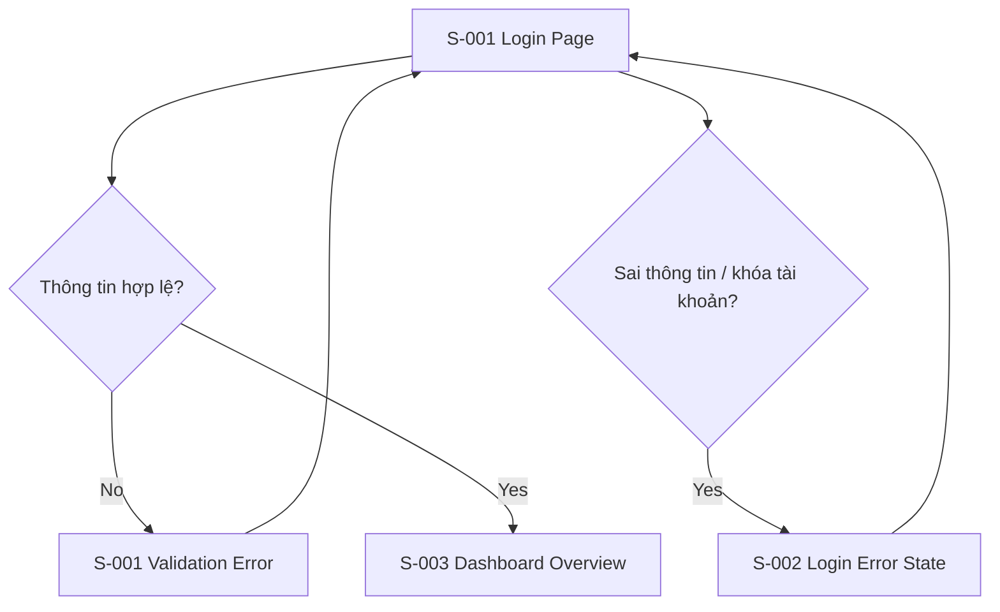

# Screen Flow: SF-001 - Authentication (Đăng nhập & Xác thực)

## 1. Screen Flow Overview
- **Screen Flow ID**: SF-001
- **Screen Flow Name**: Authentication (Đăng nhập & Xác thực)
- **Related User Flow**: UF-001
- **Description**: Chuyển luồng đăng nhập nghiệp vụ thành trải nghiệm màn hình cho giáo viên truy cập hệ thống và đi tới Dashboard.
- **Primary Actor**: Teacher / Course Creator
- **User Goal**: Đăng nhập thành công vào hệ thống.
- **Entry Screen**: S-001 Login Page
- **Exit Screen(s)**: S-003 Dashboard Overview

## 2. Screen Inventory
| Screen ID | Screen Name | Screen Type | Purpose |
|---|---|---|---|
| S-001 | Login Page | Page | Hiển thị form đăng nhập và điều kiện validation |
| S-002 | Login Error State | Page | Hiển thị lỗi sai thông tin hoặc tài khoản bị khóa |
| S-003 | Dashboard Overview | Page | Trang đích sau khi đăng nhập thành công |

## 3. Navigation Matrix
| Current Screen | User Action | Next Screen | Navigation Type | Condition |
|---|---|---|---|---|
| S-001 | Nhập thông tin và bấm Đăng nhập | S-003 | Redirect | Thông tin hợp lệ |
| S-001 | Bấm Đăng nhập với trường trống | S-001 | Inline Update | Validation lỗi |
| S-001 | Nhập sai thông tin | S-002 | Replace Page | Sai tài khoản/mật khẩu |
| S-002 | Thử lại | S-001 | Back | Người dùng nhập lại |
| S-002 | Đợi hết thời gian khóa | S-001 | Redirect | Hết thời gian khóa tài khoản |

## 4. Screen Specifications
### S-001 Login Page
- **Purpose**: Cho phép người dùng nhập thông tin đăng nhập.
- **Layout Summary**: Trang trung tâm, card form, tiêu đề đăng nhập.
- **Main Content**: Email, mật khẩu, nút đăng nhập, hướng dẫn ngắn.
- **Key Components**: Form, input fields, primary CTA, inline validation.
- **User Actions**: Nhập thông tin, submit, chuyển sang đăng nhập bằng SSO nếu có.
- **Validation Summary**: Bắt buộc nhập email/mật khẩu; hiển thị lỗi ngay tại chỗ.
- **Success Transition**: Chuyển sang dashboard.
- **Error Transition**: Chuyển sang trạng thái lỗi đăng nhập.

### S-002 Login Error State
- **Purpose**: Hiển thị lỗi khi đăng nhập thất bại hoặc tài khoản bị khóa.
- **Layout Summary**: Giữ nguyên form nhưng thêm alert và thông điệp trạng thái.
- **Main Content**: Thông báo lỗi, khả năng thử lại.
- **Key Components**: Alert banner, retry action, help text.
- **User Actions**: Thử lại, quay lại form.
- **Validation Summary**: Không có validation mới; chỉ hiện lỗi.
- **Success Transition**: Quay về form nhập lại.
- **Error Transition**: Giữ trạng thái lỗi cho đến khi nhập lại.

### S-003 Dashboard Overview
- **Purpose**: Hiển thị tổng quan sau khi đăng nhập thành công.
- **Layout Summary**: Header, sidebar, phần nội dung overview.
- **Main Content**: Dashboard khóa học, trạng thái hệ thống, CTA kết nối dữ liệu.
- **Key Components**: Header, navigation, cards, CTA.
- **User Actions**: Xem dashboard, truy cập các tính năng khác.
- **Validation Summary**: Không áp dụng.
- **Success Transition**: Mở dashboard.
- **Error Transition**: Không áp dụng.

## 5. Screen States
| Screen ID | States |
|---|---|
| S-001 | Default, Error, Disabled |
| S-002 | Error, Processing |
| S-003 | Default, Loading |

## 6. Mermaid Screen Flow

## 7. Reusable UI Components
### Layout
- Header
- Sidebar
- Content container

### Navigation
- Primary navigation
- Breadcrumb

### Input
- Text field
- Password field
- Form

### Feedback
- Alert banner
- Inline validation
- Toast

## 8. Design Pattern Suggestions
- **Navigation Pattern**: Single-step authentication flow with clear return path.
- **Layout Pattern**: Centered form card for login.
- **Form Pattern**: Minimal form with inline errors.
- **Validation Pattern**: Field-level validation and global error alert.
- **Feedback Pattern**: Inline error and toast for network failure.
- **Error Handling Pattern**: Retry path and lockout notice.
- **Loading Pattern**: Lightweight loading state on submit.
- **Accessibility Considerations**: Label rõ ràng, focus management, color contrast.
- **Responsive Behaviour**: Form chuyển thành chiều dọc trên màn hình nhỏ.

## 9. Assumptions
- Không có màn hình Quên mật khẩu trong MVP, nên chưa thiết kế riêng luồng này.
- Giả định dashboard được mở sau khi session được tạo thành công.
