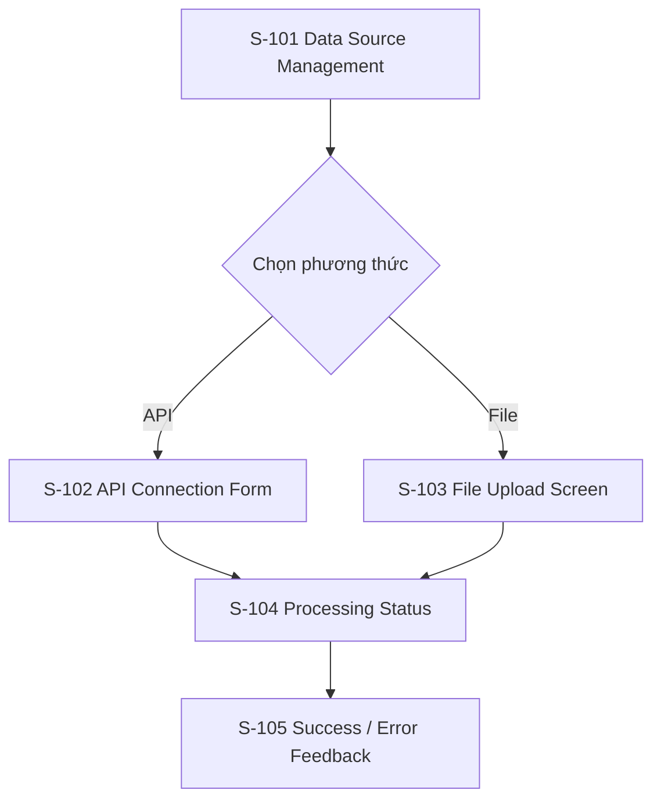

# Screen Flow: SF-002 - Data Integration & Ingestion (Kết nối & Nạp dữ liệu)

## 1. Screen Flow Overview
- **Screen Flow ID**: SF-002
- **Screen Flow Name**: Data Integration & Ingestion (Kết nối & Nạp dữ liệu)
- **Related User Flow**: UF-002
- **Description**: Chuyển luồng nạp dữ liệu Udemy thành trải nghiệm màn hình cho việc chọn phương thức nhập dữ liệu, xử lý và xem kết quả.
- **Primary Actor**: Teacher / Course Creator
- **User Goal**: Kết nối hoặc tải dữ liệu thành công để kích hoạt phân tích.
- **Entry Screen**: S-101 Data Source Management
- **Exit Screen(s)**: S-105 Success / Error Feedback

## 2. Screen Inventory
| Screen ID | Screen Name | Screen Type | Purpose |
|---|---|---|---|
| S-101 | Data Source Management | Page | Chọn phương thức nhập dữ liệu |
| S-102 | API Connection Form | Form | Nhập API credentials |
| S-103 | File Upload Screen | Page | Kéo thả hoặc chọn file Udemy |
| S-104 | Processing Status | Processing Page | Hiển thị trạng thái xử lý |
| S-105 | Success / Error Feedback | Result Page | Hiển thị kết quả import |

## 3. Navigation Matrix
| Current Screen | User Action | Next Screen | Navigation Type | Condition |
|---|---|---|---|---|
| S-101 | Chọn Kết nối API | S-102 | Redirect | Người dùng chọn API |
| S-101 | Chọn Tải File | S-103 | Redirect | Người dùng chọn File |
| S-102 | Nhấn Kết nối | S-104 | Redirect | Credentials hợp lệ |
| S-102 | Nhấn Kết nối | S-105 | Modal | Kết nối thất bại |
| S-103 | Tải lên file | S-104 | Redirect | File hợp lệ |
| S-103 | Tải lên file | S-105 | Modal | File không hợp lệ |
| S-104 | Xử lý xong | S-105 | Replace Page | Thành công hoặc lỗi |

## 4. Screen Specifications
### S-101 Data Source Management
- **Purpose**: Cho phép người dùng chọn sumber dữ liệu.
- **Layout Summary**: Hai card lựa chọn, mỗi card mô tả một phương thức.
- **Main Content**: API connection, file upload, giới hạn MVP.
- **Key Components**: Cards, CTA buttons, helper text.
- **User Actions**: Chọn API hoặc upload file.
- **Validation Summary**: Không có validation ban đầu.
- **Success Transition**: Chuyển sang form tương ứng.
- **Error Transition**: Không áp dụng.

### S-102 API Connection Form
- **Purpose**: Thu thập thông tin kết nối Udemy.
- **Layout Summary**: Form đơn giản, các trường bắt buộc.
- **Main Content**: Client ID, API Key, nút kết nối.
- **Key Components**: Form fields, submit button, error hints.
- **User Actions**: Nhập credentials, kết nối.
- **Validation Summary**: Kiểm tra trường bắt buộc, báo lỗi nếu thiếu hoặc không hợp lệ.
- **Success Transition**: Chuyển sang màn hình xử lý.
- **Error Transition**: Hiển thị lỗi ở màn hình kết quả.

### S-103 File Upload Screen
- **Purpose**: Cho phép người dùng chọn và upload file Udemy.
- **Layout Summary**: Drag-and-drop area và nút chọn file.
- **Main Content**: File metadata, preview, lựa chọn upload.
- **Key Components**: Upload area, file list, action button.
- **User Actions**: Chọn file, upload, hủy.
- **Validation Summary**: Kiểm tra định dạng và cấu trúc file.
- **Success Transition**: Chuyển sang màn hình xử lý.
- **Error Transition**: Hiển thị lỗi cấu trúc hoặc giới hạn MVP.

### S-104 Processing Status
- **Purpose**: Cho thấy tiến trình xử lý dữ liệu.
- **Layout Summary**: Progress stepper hoặc progress bar.
- **Main Content**: Các bước xử lý như validate, parse, anonymize, store.
- **Key Components**: Progress bar, loading indicator, status text.
- **User Actions**: Chờ xử lý, hủy nếu cần.
- **Validation Summary**: Không áp dụng.
- **Success Transition**: Chuyển sang kết quả.
- **Error Transition**: Chuyển sang thông báo lỗi.

### S-105 Success / Error Feedback
- **Purpose**: Hiển thị kết quả cuối cùng của quá trình import.
- **Layout Summary**: Result card hoặc modal.
- **Main Content**: Thông báo thành công hoặc lỗi và CTA tiếp tục.
- **Key Components**: Success/error icon, CTA, short explanation.
- **User Actions**: Quay lại dashboard, thử lại, sửa dữ liệu.
- **Validation Summary**: Không áp dụng.
- **Success Transition**: Chuyển về dashboard.
- **Error Transition**: Giữ lại màn hình để sửa lỗi.

## 5. Screen States
| Screen ID | States |
|---|---|
| S-101 | Default |
| S-102 | Default, Error |
| S-103 | Default, Error, Processing |
| S-104 | Processing, Success, Error |
| S-105 | Success, Error |

## 6. Mermaid Screen Flow

## 7. Reusable UI Components
### Layout
- Header
- Sidebar
- Content body

### Navigation
- Tabs / card switcher
- CTA buttons

### Input
- Form fields
- File upload area

### Feedback
- Progress bar
- Toast
- Alert

## 8. Design Pattern Suggestions
- **Navigation Pattern**: Choice-based onboarding for data source selection.
- **Layout Pattern**: Two-card chooser for method selection.
- **Form Pattern**: Compact form for credentials.
- **Validation Pattern**: Inline validation + file schema warnings.
- **Feedback Pattern**: Progress indicator and result-state messaging.
- **Error Handling Pattern**: Clear error cards for invalid file or API failure.
- **Loading Pattern**: Skeleton or progress stepper.
- **Accessibility Considerations**: Screen-reader labels for upload and input fields.
- **Responsive Behaviour**: File uploader stacks vertically on small screens.

## 9. Assumptions
- Giả định màn hình quản lý nguồn dữ liệu nằm trong menu Settings hoặc Data Management.
- Giả định kết quả import có thể hiển thị qua modal hoặc page result tùy thiết kế.
