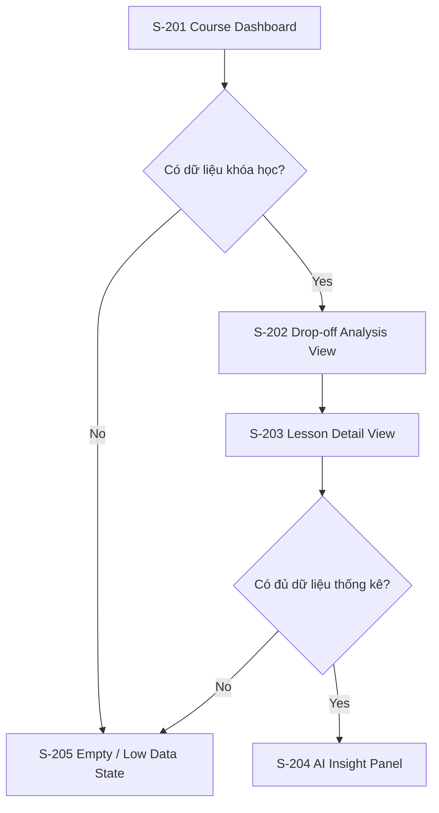

# Screen Flow: SF-003 - Course Analytics & AI Optimization (Phân tích khóa học & Tối ưu hóa bằng AI)

## 1. Screen Flow Overview
- **Screen Flow ID**: SF-003
- **Screen Flow Name**: Course Analytics & AI Optimization (Phân tích khóa học & Tối ưu hóa bằng AI)
- **Related User Flow**: UF-003
- **Description**: Chuyển luồng phân tích khóa học thành một chuỗi màn hình cho dashboard, phân tích điểm dừng và đề xuất AI.
- **Primary Actor**: Teacher / Course Creator
- **User Goal**: Xác định điểm nghẽn học tập và chuẩn bị điều chỉnh cho lớp học offline.
- **Entry Screen**: S-201 Course Dashboard
- **Exit Screen(s)**: S-204 AI Insight Panel

## 2. Screen Inventory
| Screen ID | Screen Name | Screen Type | Purpose |
|---|---|---|---|
| S-201 | Course Dashboard | Page | Hiển thị tổng quan khóa học |
| S-202 | Drop-off Analysis View | Page | Hiển thị biểu đồ và các bài giảng có vấn đề |
| S-203 | Lesson Detail View | Page | Hiển thị chi tiết bài giảng và timeline |
| S-204 | AI Insight Panel | Page | Hiển thị đề xuất và hành động AI |
| S-205 | Empty / Low Data State | Result Page | Trạng thái khi chưa có dữ liệu hoặc dữ liệu quá ít |

## 3. Navigation Matrix
| Current Screen | User Action | Next Screen | Navigation Type | Condition |
|---|---|---|---|---|
| S-201 | Chọn khóa học | S-201 | Inline Update | Xem dashboard khóa học |
| S-201 | Chuyển tab Phân tích điểm dừng | S-202 | Redirect | Có dữ liệu |
| S-202 | Chọn bài giảng | S-203 | Redirect | Bài giảng hợp lệ |
| S-203 | Mở AI Insights | S-204 | Redirect | Có đủ dữ liệu |
| S-201 | Không có dữ liệu | S-205 | Replace Page | Empty state |
| S-203 | Dữ liệu quá ít | S-205 | Replace Page | Dưới 30 học viên |

## 4. Screen Specifications
### S-201 Course Dashboard
- **Purpose**: Cung cấp tổng quan về sức khỏe khóa học.
- **Layout Summary**: Header, sidebar, overview cards và charts.
- **Main Content**: Completion rate, drop-off rate, active/inactive/at-risk summary.
- **Key Components**: KPI cards, charts, course list.
- **User Actions**: Chọn khóa học, chuyển tab.
- **Validation Summary**: Không áp dụng.
- **Success Transition**: Chuyển sang phân tích điểm dừng.
- **Error Transition**: Chuyển sang empty state.

### S-202 Drop-off Analysis View
- **Purpose**: Hiển thị các bài giảng có tỷ lệ bỏ học cao.
- **Layout Summary**: Funnel chart và danh sách hot spots.
- **Main Content**: Biểu đồ phễu, bài giảng cảnh báo, ngưỡng drop-off.
- **Key Components**: Charts, warning chips, lesson list.
- **User Actions**: Chọn bài giảng để xem chi tiết.
- **Validation Summary**: Có thể ẩn/hiện dựa trên ngưỡng cảnh báo.
- **Success Transition**: Chuyển sang lesson detail.
- **Error Transition**: Nếu dữ liệu không tồn tại thì chuyển empty state.

### S-203 Lesson Detail View
- **Purpose**: Hiển thị tư liệu chi tiết cho bài giảng bị cảnh báo.
- **Layout Summary**: Header bài giảng, timeline chart, summary card.
- **Main Content**: Thời điểm học viên dừng học nhiều nhất, biểu đồ timeline.
- **Key Components**: Detail header, chart, stats list.
- **User Actions**: Xem chi tiết, mở AI insights.
- **Validation Summary**: Nếu dữ liệu quá ít thì cảnh báo.
- **Success Transition**: Chuyển sang AI insight panel.
- **Error Transition**: Chuyển sang low data state.

### S-204 AI Insight Panel
- **Purpose**: Hiển thị giả thuyết và đề xuất cải thiện từ AI.
- **Layout Summary**: Danh sách insight card với nút hành động.
- **Main Content**: Nguyên nhân, đề xuất, disclaimer về AI.
- **Key Components**: Insight cards, action buttons, disclaimers.
- **User Actions**: Áp dụng hoặc bỏ qua đề xuất.
- **Validation Summary**: Không áp dụng.
- **Success Transition**: Cập nhật danh sách gợi ý.
- **Error Transition**: Giữ lại màn hình với cảnh báo.

### S-205 Empty / Low Data State
- **Purpose**: Hiển thị trạng thái khi chưa có dữ liệu hoặc dữ liệu quá ít.
- **Layout Summary**: Empty state card với CTA hướng dẫn.
- **Main Content**: Văn bản hướng dẫn và nút kết nối dữ liệu.
- **Key Components**: CTA button, illustration placeholder.
- **User Actions**: Kết nối dữ liệu hoặc quay lại dashboard.
- **Validation Summary**: Không áp dụng.
- **Success Transition**: Chuyển sang màn hình nhập dữ liệu.
- **Error Transition**: Giữ lại trạng thái trống.

## 5. Screen States
| Screen ID | States |
|---|---|
| S-201 | Default, Loading |
| S-202 | Default, Loading, Empty |
| S-203 | Default, Loading, Error |
| S-204 | Default, Success, Error |
| S-205 | Empty, Error |

## 6. Mermaid Screen Flow

## 7. Reusable UI Components
### Layout
- Header
- Sidebar
- Content container

### Navigation
- Tabs
- Filter chips

### Data Display
- KPI cards
- Chart cards
- Tables

### Feedback
- Badge for warning
- Alert banner

## 8. Design Pattern Suggestions
- **Navigation Pattern**: Drill-down from overview to lesson detail.
- **Layout Pattern**: Dashboard-first layout with side-by-side content blocks.
- **Form Pattern**: Not applicable.
- **Validation Pattern**: Data reliability warnings with threshold messaging.
- **Feedback Pattern**: Warning chips and inline explanations.
- **Error Handling Pattern**: Empty and low-data states.
- **Loading Pattern**: Skeleton loaders for overview charts.
- **Accessibility Considerations**: Chart alternatives and keyboard navigable tabs.
- **Responsive Behaviour**: Charts collapse into stacked views on smaller screens.

## 9. Assumptions
- Giả định các biểu đồ được hiển thị trực tiếp trên các page thay vì trong modal.
- Giả định người dùng có thể mở AI insight panel từ lesson detail page.
