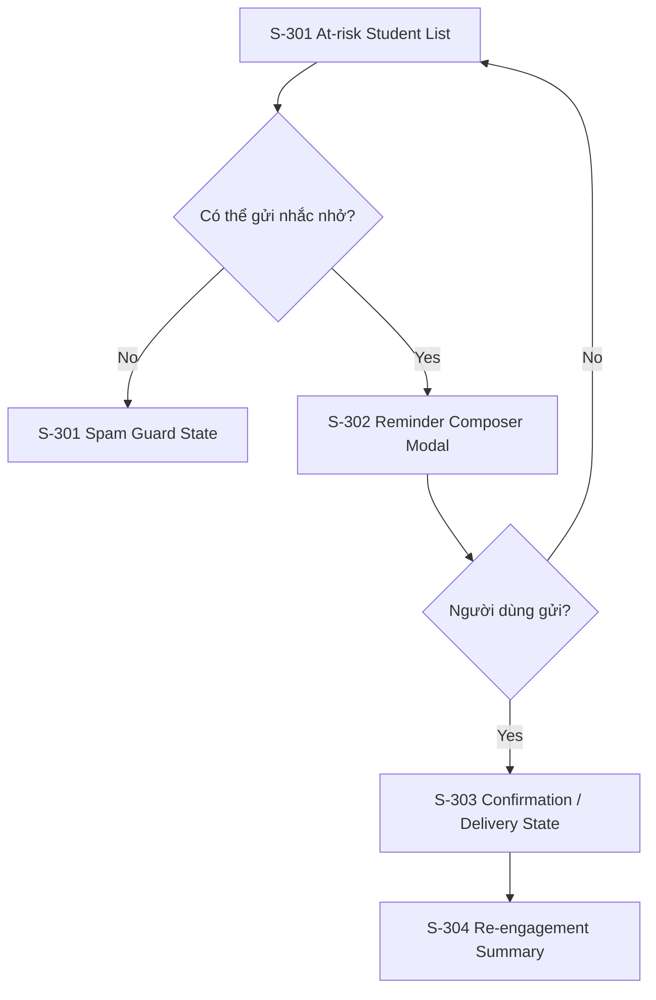

# Screen Flow: SF-004 - Student Intervention & Re-engagement (Kích hoạt & Can thiệp học viên bỏ dở)

## 1. Screen Flow Overview
- **Screen Flow ID**: SF-004
- **Screen Flow Name**: Student Intervention & Re-engagement (Kích hoạt & Can thiệp học viên bỏ dở)
- **Related User Flow**: UF-004
- **Description**: Chuyển luồng can thiệp học viên thành các màn hình giúp giảng viên xem danh sách, soạn nhắc nhở và theo dõi phản hồi sau khi gửi.
- **Primary Actor**: Teacher / Course Creator
- **User Goal**: Gửi nhắc nhở hiệu quả để học viên quay lại học.
- **Entry Screen**: S-301 At-risk Student List
- **Exit Screen(s)**: S-304 Re-engagement Summary

## 2. Screen Inventory
| Screen ID | Screen Name | Screen Type | Purpose |
|---|---|---|---|
| S-301 | At-risk Student List | Page | Hiển thị danh sách học viên cần can thiệp |
| S-302 | Reminder Composer Modal | Modal | Soạn và chỉnh sửa tin nhắn nhắc nhở |
| S-303 | Confirmation / Delivery State | Result Page | Hiển thị kết quả gửi và trạng thái can thiệp |
| S-304 | Re-engagement Summary | Page | Theo dõi kết quả sau 7 ngày |

## 3. Navigation Matrix
| Current Screen | User Action | Next Screen | Navigation Type | Condition |
|---|---|---|---|---|
| S-301 | Chọn học viên | S-302 | Modal | Có thể can thiệp |
| S-302 | Nhấn Gửi | S-303 | Redirect | Gửi thành công |
| S-302 | Nhấn Hủy | S-301 | Close | Người dùng hủy |
| S-303 | Xem kết quả | S-304 | Redirect | Sau 7 ngày theo dõi |
| S-301 | Học viên nhận tin gần đây | S-301 | Inline Update | Spam guard active |

## 4. Screen Specifications
### S-301 At-risk Student List
- **Purpose**: Cung cấp danh sách học viên cần can thiệp.
- **Layout Summary**: Bảng dữ liệu với filter và cột hành động.
- **Main Content**: Danh sách học viên, trạng thái, số ngày không hoạt động.
- **Key Components**: Table, filtering, action button.
- **User Actions**: Chọn học viên, gửi nhắc nhở hàng loạt.
- **Validation Summary**: Chặn gửi nếu học viên đã nhận tin trong vòng 7 ngày.
- **Success Transition**: Mở modal soạn tin nhắn.
- **Error Transition**: Hiển thị cảnh báo spam guard.

### S-302 Reminder Composer Modal
- **Purpose**: Cho phép người dùng chỉnh sửa nội dung nhắc nhở.
- **Layout Summary**: Modal trung tâm với textarea và nút gửi/hủy.
- **Main Content**: Nội dung mẫu AI, biến động cá nhân hóa.
- **Key Components**: Text editor, send button, cancel button.
- **User Actions**: Chỉnh sửa nội dung, gửi.
- **Validation Summary**: Kiểm tra nội dung không trống.
- **Success Transition**: Chuyển sang confirmation state.
- **Error Transition**: Giữ lại modal với lỗi gửi.

### S-303 Confirmation / Delivery State
- **Purpose**: Hiển thị kết quả việc gửi nhắc nhở.
- **Layout Summary**: Result card hoặc toast.
- **Main Content**: Thông báo thành công/lỗi, trạng thái theo dõi.
- **Key Components**: Status icon, action button, summary text.
- **User Actions**: Xem kết quả tiếp theo, quay lại danh sách.
- **Validation Summary**: Không áp dụng.
- **Success Transition**: Chuyển sang re-engagement summary.
- **Error Transition**: Quay lại màn hình danh sách.

### S-304 Re-engagement Summary
- **Purpose**: Cung cấp báo cáo sau thời gian theo dõi 7 ngày.
- **Layout Summary**: Cards kết quả và bảng trạng thái.
- **Main Content**: Tỷ lệ quay lại học, danh sách đã re-engaged.
- **Key Components**: Summary cards, table, status indicators.
- **User Actions**: Quay lại danh sách hoặc xem chi tiết.
- **Validation Summary**: Không áp dụng.
- **Success Transition**: Kết thúc luồng.
- **Error Transition**: Giữ lại trạng thái không re-engaged.

## 5. Screen States
| Screen ID | States |
|---|---|
| S-301 | Default, Disabled, Error |
| S-302 | Default, Error |
| S-303 | Success, Error |
| S-304 | Default, Success, Empty |

## 6. Mermaid Screen Flow

## 7. Reusable UI Components
### Layout
- Header
- Sidebar
- Content area

### Navigation
- Filter bar
- Action buttons

### Data Display
- Table
- Status chips
- Summary cards

### Overlay
- Modal
- Toast

## 8. Design Pattern Suggestions
- **Navigation Pattern**: List-to-action pattern.
- **Layout Pattern**: Table-first with side action panel or modal.
- **Form Pattern**: Modal composer for content editing.
- **Validation Pattern**: Prevent duplicate reminder within 7 days.
- **Feedback Pattern**: Toast and status banners.
- **Error Handling Pattern**: Spam guard and failed delivery notice.
- **Loading Pattern**: Pending state while sending reminder.
- **Accessibility Considerations**: Keyboard navigation for table rows and modal.
- **Responsive Behaviour**: Table stacks into cards on smaller screens.

## 9. Assumptions
- Giả định việc gửi nhắc nhở có thể mở dưới dạng modal hoặc drawer tùy thiết kế.
- Giả định re-engagement summary sẽ hiển thị sau khi hệ thống theo dõi đủ 7 ngày.
