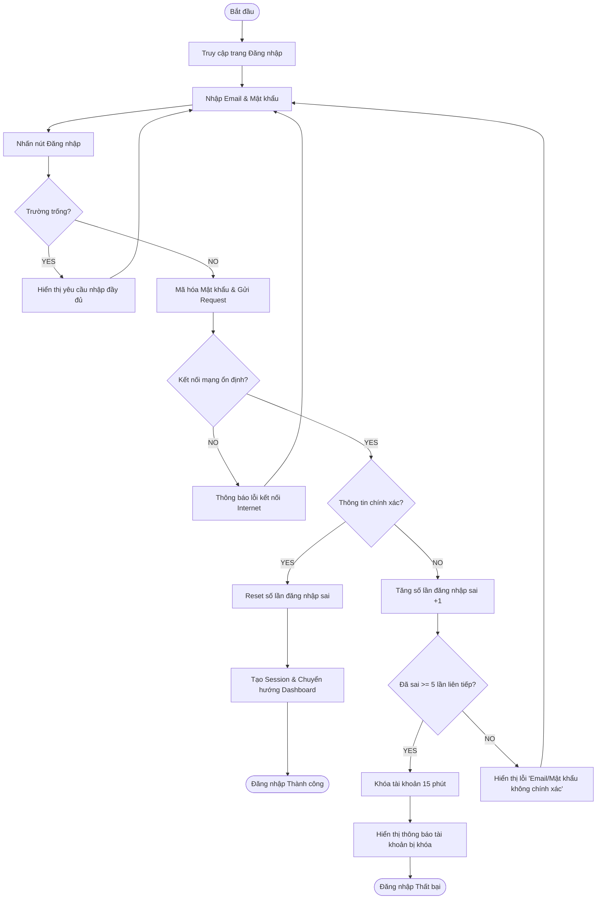

# User Flow: UF-001 - Authentication (Đăng nhập & Xác thực)

Tài liệu này đặc tả chi tiết luồng đăng nhập và xác thực của Giảng viên (Course Creator) vào hệ thống Nền tảng AI Learning Analytics.

---

## 1. Flow Overview
* **Flow ID**: UF-001
* **Flow Name**: Authentication (Đăng nhập & Xác thực)
* **Description**: Cho phép giảng viên đăng nhập an toàn vào hệ thống để truy cập vào Dashboard quản lý và các tính năng phân tích dữ liệu khóa học Udemy.
* **Primary Actor**: Teacher / Course Creator (Giảng viên / Người tạo khóa học)
* **User Goal**: Đăng nhập thành công vào hệ thống và được chuyển hướng tới trang Dashboard tổng quan của cá nhân.
* **Related User Stories**: [US-001: Giáo viên đăng nhập hệ thống](file:///c:/Users/admin/Documents/AI%20for%20vietnam/Agentic%20SDLC/phase_2_story_definition/UserStories.md#us-001-giáo-viên-đăng-nhập-hệ-thống)

---

## 2. Entry Points
* Trực tiếp truy cập URL của hệ thống (ví dụ: `https://analytics.lms-platform.com/login`).
* Nhấp vào nút "Đăng nhập" từ trang giới thiệu sản phẩm (Landing Page).
* Tự động chuyển hướng từ các trang yêu cầu quyền xác thực khi phiên làm việc (Session) hết hạn.

---

## 3. Preconditions
* Giáo viên đã có tài khoản hợp lệ được đăng ký hoặc cấp phép trước đó trên hệ thống.
* Thiết bị sử dụng có kết nối Internet.

---

## 4. Happy Path
| Step | Actor | Action | System Response | Related Story |
| :---: | :---: | :---: | :---: | :---: |
| 1 | Giáo viên | Truy cập trang đăng nhập hệ thống | Hiển thị Form Đăng nhập chứa các trường: Email, Mật khẩu và nút "Đăng nhập". | [US-001](file:///c:/Users/admin/Documents/AI%20for%20vietnam/Agentic%20SDLC/phase_2_story_definition/UserStories.md#us-001-giáo-viên-đăng-nhập-hệ-thống) |
| 2 | Giáo viên | Nhập chính xác Email và Mật khẩu | Cho phép nhập và hiển thị ký tự (mật khẩu được ẩn mặc định dưới dạng dấu chấm/sao). | [US-001](file:///c:/Users/admin/Documents/AI%20for%20vietnam/Agentic%20SDLC/phase_2_story_definition/UserStories.md#us-001-giáo-viên-đăng-nhập-hệ-thống) |
| 3 | Giáo viên | Nhấp chọn nút "Đăng nhập" | 1. Mã hóa mật khẩu khi gửi yêu cầu. 2. Xác thực tài khoản thành công. 3. Tạo session/token làm việc. 4. Chuyển hướng giáo viên sang trang Dashboard tổng quan. | [US-001](file:///c:/Users/admin/Documents/AI%20for%20vietnam/Agentic%20SDLC/phase_2_story_definition/UserStories.md#us-001-giáo-viên-đăng-nhập-hệ-thống) |

---

## 5. Decision Points
### D-001: Email/Mật khẩu có để trống không?
* **YES**: Chuyển tới **Alternative Flow: Bỏ trống thông tin đăng nhập** (Hiển thị lỗi validate tại chỗ).
* **NO**: Tiếp tục thực hiện gửi yêu cầu xác thực.

### D-002: Tài khoản & Mật khẩu có chính xác không?
* **YES**: Đăng nhập thành công, chuyển tới **Success State**.
* **NO**: Chuyển tới **Exception Flow: Sai thông tin đăng nhập**.

### D-003: Số lần đăng nhập sai liên tiếp có đạt ngưỡng khóa (5 lần)?
* **YES**: Chuyển tới **Exception Flow: Khóa tài khoản do spam đăng nhập**.
* **NO**: Tăng số lần đếm sai và hiển thị thông báo lỗi tương ứng.

---

## 6. Alternative Flows
### AF-001: Bỏ trống thông tin đăng nhập
* **Mô tả**: Giáo viên không nhập Email hoặc Mật khẩu nhưng bấm "Đăng nhập".
* **Các bước thực hiện**:
  1. Tại bước 2 của Happy Path, giáo viên để trống trường Email, Mật khẩu hoặc cả hai.
  2. Giáo viên nhấp nút "Đăng nhập".
  3. Hệ thống chặn không gửi request lên server và hiển thị cảnh báo đỏ ngay dưới các trường bị trống: *"Vui lòng nhập Email của bạn"* hoặc *"Vui lòng nhập Mật khẩu của bạn"*.
  4. Giáo viên nhập đầy đủ thông tin -> Hệ thống xóa cảnh báo và cho phép thực hiện tiếp Happy Path.

---

## 7. Exception Flows
### EF-001: Sai thông tin đăng nhập (Sai mật khẩu/Tài khoản không tồn tại)
* **Mô tả**: Giáo viên nhập sai Email hoặc Mật khẩu.
* **Các bước thực hiện**:
  1. Giáo viên nhập sai thông tin và nhấn "Đăng nhập".
  2. Hệ thống kiểm tra thấy thông tin không trùng khớp.
  3. Hệ thống hiển thị thông báo lỗi chung: *"Email hoặc Mật khẩu không chính xác"*.
  4. Hệ thống giữ nguyên giao diện để người dùng nhập lại. Số lần đăng nhập sai của tài khoản đó (hoặc IP đó) tăng thêm 1.

### EF-002: Khóa tài khoản do spam đăng nhập (Quá 5 lần)
* **Mô tả**: Giáo viên nhập sai mật khẩu liên tiếp 5 lần.
* **Các bước thực hiện**:
  1. Tại lần thử thứ 5 liên tiếp bị sai, hệ thống ghi nhận vượt ngưỡng.
  2. Hệ thống tạm thời khóa tài khoản trong vòng 15 phút.
  3. Hệ thống hiển thị thông báo lỗi: *"Tài khoản của bạn đã bị khóa tạm thời trong 15 phút do nhập sai mật khẩu quá 5 lần. Vui lòng thử lại sau."*
  4. Mọi yêu cầu đăng nhập tiếp theo bằng tài khoản này trong vòng 15 phút đều bị từ chối ngay lập tức từ phía máy chủ.

### EF-003: Mất kết nối Internet đột ngột
* **Mô tả**: Mất kết nối mạng trong quá trình gửi yêu cầu đăng nhập.
* **Các bước thực hiện**:
  1. Giáo viên nhấn "Đăng nhập".
  2. Hệ thống thực hiện gửi yêu cầu nhưng không nhận được phản hồi do mất kết nối mạng.
  3. Hiển thị thông báo: *"Không thể kết nối mạng. Vui lòng kiểm tra lại kết nối Internet và thử lại."*
  4. Trạng thái giao diện quay về Form đăng nhập có giữ lại thông tin Email đã nhập.

---

## 8. Business Rules Applied
* **BR-001 (Mã hóa mật khẩu)**: Mật khẩu của giáo viên bắt buộc phải được mã hóa một chiều (ví dụ: bcrypt/argon2) khi lưu trữ ở cơ sở dữ liệu và được truyền tải qua giao thức bảo mật HTTPS (SSL/TLS). *(Nguồn: US-001)*
* **BR-002 (Khóa tài khoản tạm thời)**: Số lần thử đăng nhập sai tối đa liên tiếp là 5 lần. Sau 5 lần sai, tài khoản bị khóa 15 phút. *(Nguồn: US-001)*

---

## 9. Success State
* Giáo viên đăng nhập thành công.
* Session ID / Access Token (JWT) được lưu trữ an toàn ở phía Client (HttpOnly Cookie).
* Giao diện chuyển hướng thành công đến màn hình Dashboard tổng quan.

---

## 10. Failure State
* Tài khoản bị khóa tạm thời (EF-002).
* Giáo viên bị kẹt ở màn hình đăng nhập với thông báo lỗi thông tin không chính xác hoặc lỗi mạng.

---

## 11. Mermaid User Flow

---

## 12. Story Mapping
| Step | Story |
| :--- | :--- |
| Step 1: Truy cập trang đăng nhập | [US-001](file:///c:/Users/admin/Documents/AI%20for%20vietnam/Agentic%20SDLC/phase_2_story_definition/UserStories.md#us-001-giáo-viên-đăng-nhập-hệ-thống) |
| Step 2: Nhập thông tin tài khoản | [US-001](file:///c:/Users/admin/Documents/AI%20for%20vietnam/Agentic%20SDLC/phase_2_story_definition/UserStories.md#us-001-giáo-viên-đăng-nhập-hệ-thống) |
| Step 3: Xác thực tài khoản & Chuyển hướng | [US-001](file:///c:/Users/admin/Documents/AI%20for%20vietnam/Agentic%20SDLC/phase_2_story_definition/UserStories.md#us-001-giáo-viên-đăng-nhập-hệ-thống) |

---

## 13. UX Improvement Suggestions
* **Thêm tùy chọn "Hiển thị mật khẩu"**: Giúp người dùng kiểm tra lại mật khẩu đã gõ để tránh nhập sai dẫn tới khóa tài khoản ngoài ý muốn.
* **Cảnh báo trước khi khóa**: Khi người dùng nhập sai tới lần thứ 4, hiển thị cảnh báo đỏ đậm: *"Lưu ý: Bạn chỉ còn 1 lần thử trước khi tài khoản bị khóa 15 phút."*
* **Tự động Focus**: Focus con trỏ chuột vào ô nhập Email ngay khi tải trang và tự động chuyển sang ô Mật khẩu khi nhấn phím `Enter` hoặc `Tab`.

---

## 14. Missing Requirements
* **Mất mật khẩu**: Hiện tại US-001 chưa định nghĩa luồng "Quên mật khẩu" (Forgot Password). Để hoàn thiện hệ thống, cần bổ sung User Story cho tính năng gửi email đặt lại mật khẩu.
* **Đăng nhập một chạm (SSO)**: Chưa xác định MVP có cần tích hợp đăng nhập qua Google hay tài khoản Udemy trực tiếp hay không. *(Câu hỏi mở từ US-001)*
