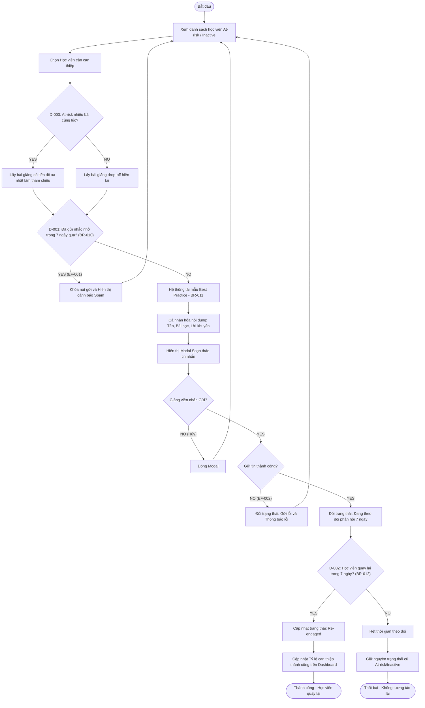

# User Flow: UF-004 - Student Intervention & Re-engagement (Kích hoạt & Can thiệp học viên bỏ dở)

Tài liệu này đặc tả chi tiết luồng giảng viên can thiệp bằng cách gửi nhắc nhở cá nhân hóa dựa trên Best Practice để kêu gọi học viên At-risk/Inactive quay lại học tập.

---

## 1. Flow Overview
* **Flow ID**: UF-004
* **Flow Name**: Student Intervention & Re-engagement (Kích hoạt & Can thiệp học viên bỏ dở)
* **Description**: Giảng viên duyệt danh sách học viên bỏ dở tại một bài học cụ thể hoặc danh sách học viên At-risk/Inactive của khóa học, chọn học viên cần can thiệp, xem trước mẫu tin nhắn tự động được tối ưu hóa từ "Best Practice" của nhóm hoàn thành nhanh, chỉnh sửa và gửi nhắc nhở. Hệ thống theo dõi phản hồi trong 7 ngày sau đó.
* **Primary Actor**: Teacher / Course Creator (Giảng viên / Người tạo khóa học)
* **User Goal**: Gửi thông điệp khích lệ tối ưu hóa đến học viên bỏ cuộc để chuyển đổi trạng thái của họ thành "Re-engaged" (Đã quay lại học).
* **Related User Stories**: 
  * [US-006: Gửi nhắc nhở (Reminder) cho học viên bỏ dở sử dụng Best Practice](file:///c:/Users/admin/Documents/AI%20for%20vietnam/Agentic%20SDLC/phase_2_story_definition/UserStories.md#us-006-gửi-nhắc-nhở-reminder-cho-học-viên-bỏ-dở-sử-dụng-best-practice)

---

## 2. Entry Points
* Cột thao tác "Hành động" -> Nút "Gửi nhắc nhở" trong bảng danh sách học viên thuộc phân khúc "At-risk" hoặc "Inactive" ở Dashboard tổng quan.
* Nút "Gửi nhắc nhở nhóm bỏ dở" khi xem chi tiết một bài giảng bị cảnh báo có tỷ lệ drop-off cao.

---

## 3. Preconditions
* Giảng viên đã đăng nhập và nạp thành công dữ liệu khóa học.
* Hệ thống đã xác định được phân khúc học viên (At-risk, Inactive) dựa trên BR-006.
* Hệ thống đã chạy phân tích và rút ra "Best Practice" từ nhóm học viên hoàn thành nhanh (ví dụ: thứ tự làm bài tập, thời gian ôn tập).

---

## 4. Happy Path
| Step | Actor | Action | System Response | Related Story |
| :---: | :---: | :---: | :---: | :---: |
| 1 | Giảng viên | Truy cập danh sách học viên "At-risk" của khóa học | Hiển thị bảng danh sách học viên gồm: Mã học viên (đã ẩn danh), bài giảng hiện tại đang dừng, số ngày không hoạt động, trạng thái gửi nhắc nhở gần nhất. | [US-006](file:///c:/Users/admin/Documents/AI%20for%20vietnam/Agentic%20SDLC/phase_2_story_definition/UserStories.md#us-006-gửi-nhắc-nhở-reminder-cho-học-viên-bỏ-dở-sử-dụng-best-practice) |
| 2 | Giảng viên | Nhấp chọn nút "Gửi nhắc nhở" đối với học viên mục tiêu | 1. Hệ thống kiểm tra quy tắc tần suất gửi tin (BR-010). 2. Hiển thị hộp thoại (Modal) soạn thảo tin nhắn nhắc nhở. | [US-006](file:///c:/Users/admin/Documents/AI%20for%20vietnam/Agentic%20SDLC/phase_2_story_definition/UserStories.md#us-006-gửi-nhắc-nhở-reminder-cho-học-viên-bỏ-dở-sử-dụng-best-practice) |
| 3 | Hệ thống | Tự động tạo nội dung tin nhắn dựa trên mẫu tối ưu hóa | Điền tự động các trường cá nhân hóa: Tên/Mã học viên, bài học đang dừng, và lời khuyên thành công đúc kết từ nhóm học viên học nhanh (Best Practice). | [US-006](file:///c:/Users/admin/Documents/AI%20for%20vietnam/Agentic%20SDLC/phase_2_story_definition/UserStories.md#us-006-gửi-nhắc-nhở-reminder-cho-học-viên-bỏ-dở-sử-dụng-best-practice) |
| 4 | Giảng viên | Chỉnh sửa nội dung tin nhắn nếu cần và nhấn "Gửi" | 1. Hệ thống gửi tin nhắn/email tới học viên. 2. Ghi nhận thời gian gửi và kích hoạt bộ theo dõi phản hồi 7 ngày. 3. Hiển thị thông báo "Đã gửi nhắc nhở thành công". | [US-006](file:///c:/Users/admin/Documents/AI%20for%20vietnam/Agentic%20SDLC/phase_2_story_definition/UserStories.md#us-006-gửi-nhắc-nhở-reminder-cho-học-viên-bỏ-dở-sử-dụng-best-practice) |
| 5 | Học viên | Quay lại học bài giảng mới trong vòng 7 ngày sau đó | Hệ thống đồng bộ dữ liệu tự động, phát hiện hoạt động mới, đổi trạng thái học viên thành "Re-engaged" và cập nhật tỷ lệ can thiệp thành công trên Dashboard. | [US-006](file:///c:/Users/admin/Documents/AI%20for%20vietnam/Agentic%20SDLC/phase_2_story_definition/UserStories.md#us-006-gửi-nhắc-nhở-reminder-cho-học-viên-bỏ-dở-sử-dụng-best-practice) |

---

## 5. Decision Points
### D-001: Học viên được chọn có bị chặn gửi tin nhắn do giới hạn tần suất không?
* **YES**: Chuyển tới **Exception Flow: Chặn spam gửi nhắc nhở**.
* **NO**: Tiếp tục cho phép tải mẫu tin nhắn.

### D-002: Học viên mục tiêu có quay lại hoạt động trong vòng 7 ngày kể từ khi gửi không?
* **YES**: Chuyển tới **Success State: Học viên quay lại học (Re-engaged)**.
* **NO**: Chuyển tới **Failure State: Can thiệp không thành công sau 7 ngày**.

### D-003: Học viên mục tiêu có thuộc nhiều bài giảng bị drop-off cùng lúc không?
* **YES**: Hệ thống tự động gộp nội dung can thiệp vào bài học có tiến độ xa nhất.
* **NO**: Sử dụng bài giảng drop-off duy nhất để tạo mẫu.

---

## 6. Alternative Flows
### AF-001: Gửi nhắc nhở hàng loạt (Bulk Intervention)
* **Mô tả**: Giảng viên gửi tin nhắn nhắc nhở cho nhiều học viên At-risk cùng một lúc.
* **Các bước thực hiện**:
  1. Giảng viên vào danh sách học viên At-risk, nhấp chọn hộp kiểm (checkbox) đầu dòng cho nhiều học viên.
  2. Bấm nút "Gửi nhắc nhở hàng loạt" ở đầu bảng.
  3. Hệ thống kiểm tra điều kiện lọc bỏ các học viên đã nhận tin trong 7 ngày qua.
  4. Hiển thị modal cấu hình chung kèm biến động (variables) cá nhân hóa cho từng người.
  5. Giảng viên nhấn nút "Xác nhận gửi cho [X] học viên".
  6. Hệ thống thực hiện gửi bất đồng bộ dưới background.

---

## 7. Exception Flows
### EF-001: Chặn gửi tin nhắn do spam (Trong vòng 7 ngày)
* **Mô tả**: Giảng viên cố gắng gửi tin nhắc nhở lần thứ 2 cho cùng một học viên trong vòng 7 ngày.
* **Các bước thực hiện**:
  1. Giảng viên nhấn "Gửi nhắc nhở" cho một học viên vừa mới được gửi tin cách đó 3 ngày.
  2. Hệ thống kiểm tra trường `Last_Sent_Timestamp` thấy khoảng cách < 7 ngày.
  3. Hệ thống khóa nút gửi, hiển thị cảnh báo màu vàng: *"Học viên này đã nhận tin nhắn nhắc nhở vào ngày [DD/MM/YYYY]. Bạn chỉ được gửi tiếp theo sau 7 ngày kể từ lần gửi cuối cùng để tránh gây phiền hà."*

### EF-002: Học viên tắt nhận thông báo / Email học viên bị lỗi (Bounce)
* **Mô tả**: Học viên đã hủy đăng ký nhận thông báo từ giảng viên hoặc địa chỉ email bị lỗi không thể gửi tới.
* **Các bước thực hiện**:
  1. Giảng viên nhấn gửi nhắc nhở.
  2. Hệ thống chuyển tiếp yêu cầu gửi qua API hòm thư Udemy hoặc dịch vụ Email, nhận về lỗi từ chối gửi do người dùng unsubscribe hoặc email không tồn tại.
  3. Hệ thống cập nhật trạng thái can thiệp của học viên thành: "Gửi lỗi - Học viên từ chối nhận tin".
  4. Hiển thị thông báo trên giao diện: *"Không thể gửi tin nhắn do học viên đã từ chối nhận thông báo hoặc email không khả dụng."*

### EF-003: Học viên bị At-risk ở nhiều bài giảng cùng lúc (Edge Case)
* **Mô tả**: Học viên dừng học lâu ngày và bị ghi nhận drop-off ở cả Bài giảng 3 và Bài giảng 4.
* **Các bước thực hiện**:
  1. Hệ thống phát hiện học viên trùng lặp trong danh sách bỏ dở của nhiều bài giảng.
  2. Khi sinh mẫu Best Practice, hệ thống chỉ lấy bài giảng có tiến độ cao nhất (ví dụ: Bài giảng 4) để làm thông tin tham chiếu chính, tránh việc gửi 2 email nhắc nhở độc lập cho cùng 1 học viên cùng thời điểm.

---

## 8. Business Rules Applied
* **BR-010 (Tần suất can thiệp)**: Tần suất gửi nhắc nhở tối đa là 1 tin/email cho cùng một học viên trong vòng 7 ngày để tránh spam và gây khó chịu cho học viên. *(Nguồn: US-006)*
* **BR-011 (Công thức tạo nội dung Best Practice)**: Mẫu tin nhắn phải được tạo tự động dựa trên phân tích từ nhóm học viên top đầu (nhóm hoàn thành nhanh nhất), bao gồm: thời gian học tối ưu, mẹo giải bài tập, hoặc tài liệu đọc thêm giúp họ vượt qua bài giảng đó. *(Nguồn: US-006)*
* **BR-012 (Ghi nhận Re-engaged)**: Một học viên được gắn thẻ "Re-engaged" khi và chỉ khi họ có phát hiện hoạt động học tập mới trong vòng 7 ngày kể từ thời điểm giảng viên bấm gửi tin nhắc nhở. *(Nguồn: US-006)*

---

## 9. Success State
* Tin nhắn được gửi đi thành công tới học viên mục tiêu (qua API Udemy Messages hoặc Email).
* Trạng thái học viên cập nhật: "Đang theo dõi phản hồi (Còn lại 7 ngày)".
* Học viên quay lại học trong 7 ngày -> Trạng thái đổi thành "Re-engaged", tăng tỷ lệ chuyển đổi can thiệp của khóa học.

---

## 10. Failure State
* Không gửi được tin nhắn do vi phạm quy tắc spam (7 ngày) hoặc do học viên unsubscribe.
* Sau 7 ngày gửi tin học viên vẫn không hoạt động -> Hết thời gian theo dõi, trạng thái giữ nguyên là "Inactive/At-risk" và cho phép can thiệp lần tiếp theo.

---

## 11. Mermaid User Flow

---

## 12. Story Mapping
| Step | Story |
| :--- | :--- |
| Step 1, 2: Chọn học viên và kiểm tra điều kiện spam | [US-006](file:///c:/Users/admin/Documents/AI%20for%20vietnam/Agentic%20SDLC/phase_2_story_definition/UserStories.md#us-006-gửi-nhắc-nhở-reminder-cho-học-viên-bỏ-dở-sử-dụng-best-practice) |
| Step 3: Cá nhân hóa mẫu tin nhắn Best Practice | [US-006](file:///c:/Users/admin/Documents/AI%20for%20vietnam/Agentic%20SDLC/phase_2_story_definition/UserStories.md#us-006-gửi-nhắc-nhở-reminder-cho-học-viên-bỏ-dở-sử-dụng-best-practice) |
| Step 4, 5: Gửi tin nhắn và theo dõi phản hồi trong 7 ngày | [US-006](file:///c:/Users/admin/Documents/AI%20for%20vietnam/Agentic%20SDLC/phase_2_story_definition/UserStories.md#us-006-gửi-nhắc-nhở-reminder-cho-học-viên-bỏ-dở-sử-dụng-best-practice) |

---

## 13. UX Improvement Suggestions
* **Hiển thị độ ấm học viên (Engagement Score)**: Bổ sung chỉ số điểm tương tác (ví dụ: học viên này từng hoàn thành 80% khóa học rất nhanh trước khi dừng) để giúp giảng viên ưu tiên can thiệp nhóm có khả năng quay lại cao nhất.
* **Bộ biên tập văn bản giàu tính năng (Rich Text Editor)**: Cho phép chèn link bài giảng trực tiếp, in đậm, in nghiêng hoặc chèn biểu tượng cảm xúc (emoji) vào mẫu tin nhắn để tăng tính tương tác sinh động.
* **Tự động hóa can thiệp (Auto-Intervention)**: Cho phép giảng viên bật chế độ "Tự động gửi nhắc nhở" khi học viên vừa chạm ngưỡng At-risk (ví dụ: ngày thứ 14 không hoạt động) mà không cần bấm thủ công từng người.

---

## 14. Missing Requirements
* **Kênh gửi chính thức (Channel)**: Hiện tại chưa xác định rõ kênh liên lạc chính thức là gì. Gửi qua hệ thống tin nhắn riêng tư của Udemy (Udemy Direct Messages API) hay gửi qua email cá nhân của giảng viên? Mỗi kênh có giới hạn kỹ thuật và độ phản hồi khác nhau. *(Câu hỏi mở từ US-006)*
* **Xử lý múi giờ**: Học viên ở các múi giờ khác nhau. Hệ thống cần đảm bảo tin nhắn/email nhắc nhở được gửi vào khung giờ vàng hoạt động của học viên (ví dụ: 19h-21h theo múi giờ địa phương của học viên đó) để tối ưu tỷ lệ đọc tin.
