# Task Dependencies

This document defines the inferred dependency graph for the **AI Learning Analytics MVP** task breakdown, covering all 89 tasks across Foundation (FND), Database (DB), Infrastructure (INF), Backend Feature (BE), Frontend Feature (FE), Cross-Feature Integration (INT), Testing (TST), and Release & Deployment (DEP) task groups.

Dependencies were inferred from business workflow, technical architecture, API contracts, database design, frontend/backend interaction, UI design flow, deployment order, and the task-group ordering implied by the breakdown files. Only mandatory dependencies are included — tasks that can be developed independently are intentionally left unconnected to maximize parallel work.

The graph is a DAG (no circular dependencies). Every task appears exactly once and is connected to at least one other task.

---

## Mermaid Diagram

```mermaid
flowchart TD
    %% Foundation Tasks
    FND-001 --> FND-002
    FND-001 --> FND-003
    FND-001 --> FND-031
    FND-001 --> FND-033
    FND-001 --> FND-035
    FND-001 --> FND-040
    FND-002 --> FND-004
    FND-002 --> FE-007
    FND-003 --> FND-038
    FND-004 --> FND-005
    FND-004 --> FND-008
    FND-004 --> FND-009
    FND-004 --> FND-011
    FND-004 --> FND-014
    FND-004 --> FND-015
    FND-004 --> FND-016
    FND-004 --> FND-017
    FND-004 --> FND-020
    FND-004 --> FND-021
    FND-004 --> FND-022
    FND-004 --> FND-023
    FND-004 --> FND-024
    FND-004 --> FND-025
    FND-004 --> FND-030
    FND-005 --> FND-006
    FND-005 --> FND-032
    FND-005 --> FND-039
    FND-006 --> FND-007
    FND-006 --> DB-001
    FND-008 --> FND-010
    FND-008 --> FND-029
    FND-010 --> FND-013
    FND-011 --> FND-012
    FND-011 --> FND-026
    FND-011 --> FND-027
    FND-011 --> FND-028
    FND-017 --> FND-018
    FND-017 --> FND-019
    FND-017 --> INF-001
    FND-018 --> INF-002
    FND-019 --> INF-001
    FND-021 --> INF-005
    FND-022 --> INF-004
    FND-023 --> INF-003
    FND-024 --> INF-006
    FND-025 --> INF-007
    FND-026 --> DEP-004
    FND-028 --> INF-008
    FND-031 --> FND-036
    FND-031 --> TST-001
    FND-032 --> TST-002
    FND-033 --> FND-034
    FND-033 --> FND-036
    FND-035 --> DEP-001
    FND-036 --> FND-037
    FND-037 --> DEP-003
    FND-038 --> INF-008
    FND-038 --> DEP-002
    FND-039 --> DEP-005

    %% Database Tasks
    DB-001 --> DB-002
    DB-001 --> DB-003
    DB-001 --> DB-004
    DB-001 --> BE-001
    DB-001 --> BE-004
    DB-002 --> DB-004
    DB-002 --> BE-002
    DB-002 --> BE-003
    DB-003 --> DB-004
    DB-003 --> BE-004
    DB-003 --> BE-006
    DB-004 --> DB-005
    DB-004 --> DB-006
    DB-005 --> DB-007
    DB-006 --> DB-007
    DB-007 --> DB-008
    DB-007 --> DEP-005
    DB-008 --> TST-002

    %% Infrastructure Tasks
    INF-001 --> INF-002
    INF-001 --> BE-001
    INF-003 --> INF-007
    INF-003 --> BE-007
    INF-004 --> BE-002
    INF-004 --> BE-003
    INF-005 --> BE-004
    INF-005 --> INT-005
    INF-006 --> BE-003
    INF-006 --> INT-005
    INF-007 --> BE-007
    INF-007 --> INT-005
    INF-008 --> DEP-004

    %% Backend Feature Tasks
    BE-001 --> FE-001
    BE-001 --> INT-001
    BE-002 --> FE-002
    BE-003 --> FE-002
    BE-003 --> INT-004
    BE-004 --> BE-005
    BE-004 --> BE-006
    BE-004 --> BE-007
    BE-004 --> FE-003
    BE-004 --> INT-004
    BE-005 --> BE-008
    BE-005 --> FE-004
    BE-005 --> INT-002
    BE-006 --> BE-008
    BE-006 --> FE-005
    BE-006 --> INT-002
    BE-007 --> BE-008
    BE-007 --> FE-006
    BE-007 --> INT-003
    BE-008 --> INT-006
    BE-008 --> TST-001
    BE-008 --> TST-003

    %% Frontend Feature Tasks
    FE-007 --> FE-001
    FE-007 --> FE-002
    FE-007 --> FE-003
    FE-007 --> FE-004
    FE-007 --> FE-005
    FE-007 --> FE-006
    FE-007 --> TST-004
    FE-001 --> INT-001
    FE-001 --> TST-004
    FE-002 --> INT-001
    FE-002 --> TST-004
    FE-003 --> INT-001
    FE-003 --> TST-004
    FE-004 --> INT-001
    FE-004 --> TST-004
    FE-005 --> INT-001
    FE-005 --> TST-004
    FE-006 --> INT-001
    FE-006 --> INT-003
    FE-006 --> TST-004

    %% Cross-Feature Integration Tasks
    INT-001 --> TST-005
    INT-002 --> TST-005
    INT-003 --> TST-005
    INT-004 --> TST-005

    %% Testing Tasks
    TST-001 --> DEP-003
    TST-005 --> DEP-006

    %% Release & Deployment Tasks
    DEP-006 --> TST-006
```



---

## Dependency Summary

### Foundation Tasks (FND)

### TASK FND-001
- Depends On: None
- Blocks: FND-002, FND-003, FND-031, FND-033, FND-035, FND-040
- Reason: Root task — the backend project must be initialized before any structure, environment, testing, quality, Docker, or documentation work can begin.

### TASK FND-002
- Depends On: FND-001
- Blocks: FND-004, FE-007
- Reason: Folder/project structure needs an initialized project to organize.

### TASK FND-003
- Depends On: FND-001
- Blocks: FND-038
- Reason: Environment management setup needs an initialized project.

### TASK FND-004
- Depends On: FND-002
- Blocks: FND-005, FND-008, FND-009, FND-011, FND-014, FND-015, FND-016, FND-017, FND-020, FND-021, FND-022, FND-023, FND-024, FND-025, FND-030
- Reason: The DI/IoC container requires the project structure to be defined, and almost every subsequent framework module is registered through it.

### TASK FND-005
- Depends On: FND-004
- Blocks: FND-006, FND-032, FND-039
- Reason: Database connection setup is resolved through the DI container.

### TASK FND-006
- Depends On: FND-005
- Blocks: FND-007, DB-001
- Reason: Migration framework needs an active database connection to operate against.

### TASK FND-007
- Depends On: FND-006
- Blocks: None
- Reason: Seeder framework runs on top of the migration framework/schema.

### TASK FND-008
- Depends On: FND-004
- Blocks: FND-010, FND-029
- Reason: Global exception handling is wired through the DI container.

### TASK FND-009
- Depends On: FND-004
- Blocks: None
- Reason: Validation pipeline is wired through the DI container.

### TASK FND-010
- Depends On: FND-008
- Blocks: FND-013
- Reason: Unified API response format builds on the exception-handling conventions (error shape, status codes).

### TASK FND-011
- Depends On: FND-004
- Blocks: FND-012, FND-026, FND-027, FND-028
- Reason: Logging framework is wired through the DI container.

### TASK FND-012
- Depends On: FND-011
- Blocks: None
- Reason: Request/response logging extends the base logging framework.

### TASK FND-013
- Depends On: FND-010
- Blocks: None
- Reason: API documentation (Swagger/OpenAPI) needs a stable, unified response format to document accurately.

### TASK FND-014
- Depends On: FND-004
- Blocks: None
- Reason: Health check endpoints are registered through the DI container.

### TASK FND-015
- Depends On: FND-004
- Blocks: None
- Reason: CORS policy is configured at the application level via the DI container.

### TASK FND-016
- Depends On: FND-004
- Blocks: None
- Reason: Security headers middleware is wired through the DI container.

### TASK FND-017
- Depends On: FND-004
- Blocks: FND-018, FND-019, INF-001
- Reason: Authentication framework is wired through the DI container and is the base for authorization, password hashing, and the real auth module.

### TASK FND-018
- Depends On: FND-017
- Blocks: INF-002
- Reason: Authorization (RBAC/ABAC) builds directly on the authentication framework.

### TASK FND-019
- Depends On: FND-017
- Blocks: INF-001
- Reason: Password hashing service is part of setting up the authentication framework.

### TASK FND-020
- Depends On: FND-004
- Blocks: None
- Reason: Rate limiting middleware is wired through the DI container.

### TASK FND-021
- Depends On: FND-004
- Blocks: INF-005
- Reason: Cache framework is wired through the DI container; the concrete cache service builds on it.

### TASK FND-022
- Depends On: FND-004
- Blocks: INF-004
- Reason: File storage abstraction is wired through the DI container; the concrete storage service builds on it.

### TASK FND-023
- Depends On: FND-004
- Blocks: INF-003
- Reason: Email infrastructure is wired through the DI container; the concrete email service builds on it.

### TASK FND-024
- Depends On: FND-004
- Blocks: INF-006
- Reason: Background job framework is wired through the DI container; the concrete queue infra builds on it.

### TASK FND-025
- Depends On: FND-004
- Blocks: INF-007
- Reason: Event bus is wired through the DI container; multi-channel notification builds on it.

### TASK FND-026
- Depends On: FND-011
- Blocks: DEP-004
- Reason: Monitoring metrics build on the base logging framework.

### TASK FND-027
- Depends On: FND-011
- Blocks: None
- Reason: Distributed tracing builds on the base logging framework.

### TASK FND-028
- Depends On: FND-011
- Blocks: INF-008
- Reason: Audit logging (framework-level) builds on the base logging framework; the full audit/config module builds on it.

### TASK FND-029
- Depends On: FND-008
- Blocks: None
- Reason: Error code registry standardizes the codes surfaced by global exception handling.

### TASK FND-030
- Depends On: FND-004
- Blocks: None
- Reason: Localization framework is wired through the DI container.

### TASK FND-031
- Depends On: FND-001
- Blocks: FND-036, TST-001
- Reason: Unit test framework only requires the initialized project; it is a prerequisite for CI and for writing backend unit tests.

### TASK FND-032
- Depends On: FND-005
- Blocks: TST-002
- Reason: Integration test framework needs a real database connection to test against.

### TASK FND-033
- Depends On: FND-001
- Blocks: FND-034, FND-036
- Reason: Code quality tools only require the initialized project; they feed both git hooks and CI.

### TASK FND-034
- Depends On: FND-033
- Blocks: None
- Reason: Git hooks run the configured code quality tools on commit.

### TASK FND-035
- Depends On: FND-001
- Blocks: DEP-001
- Reason: Docker environment configuration only requires the initialized project.

### TASK FND-036
- Depends On: FND-031, FND-033
- Blocks: FND-037
- Reason: CI pipeline needs the unit test framework and code quality tools to run build/test/lint steps.

### TASK FND-037
- Depends On: FND-036
- Blocks: DEP-003
- Reason: CD pipeline builds on a working CI pipeline.

### TASK FND-038
- Depends On: FND-003
- Blocks: INF-008, DEP-002
- Reason: Secrets management extends environment management with secure credential storage.

### TASK FND-039
- Depends On: FND-005
- Blocks: DEP-005
- Reason: Backup strategy requires an active database connection to back up.

### TASK FND-040
- Depends On: FND-001
- Blocks: None
- Reason: Project documentation describes the initialized project and evolves alongside it.

---

### Database Tasks (DB)

### TASK DB-001
- Depends On: FND-006
- Blocks: DB-002, DB-003, DB-004, BE-001, BE-004
- Reason: Core schema (teachers, courses, modules, lessons, enrollments, activities) requires the migration framework to be applied, and is the base table set referenced by import, analytics, auth, and analytics-service tasks.

### TASK DB-002
- Depends On: DB-001
- Blocks: DB-004, BE-002, BE-003
- Reason: Import/connection tables (data_imports, udemy_connections) reference core entities such as courses and teachers.

### TASK DB-003
- Depends On: DB-001
- Blocks: DB-004, BE-004, BE-006
- Reason: Analytics/AI insight tables (ai_insights, recommendations, reminder_logs) reference core entities such as students and lessons.

### TASK DB-004
- Depends On: DB-001, DB-002, DB-003
- Blocks: DB-005, DB-006
- Reason: Foreign keys and constraints require all referenced tables (core, import, analytics) to exist first.

### TASK DB-005
- Depends On: DB-004
- Blocks: DB-007
- Reason: Indexes are added once constraints finalize table shape, to correctly target query columns.

### TASK DB-006
- Depends On: DB-004
- Blocks: DB-007
- Reason: Soft-delete/audit columns are added once the constrained schema is stable.

### TASK DB-007
- Depends On: DB-005, DB-006
- Blocks: DB-008, DEP-005
- Reason: Migration scripts formalize the complete schema, including indexes and audit columns, and are the basis for backup/rollback planning.

### TASK DB-008
- Depends On: DB-007
- Blocks: TST-002
- Reason: Seed data requires migrations to have created the tables it populates.

---

### Infrastructure Tasks (INF)

### TASK INF-001
- Depends On: FND-017, FND-019
- Blocks: INF-002, BE-001
- Reason: The authentication module implementation needs the auth framework and password hashing service configured, and is required before the Auth API and authorization module.

### TASK INF-002
- Depends On: FND-018, INF-001
- Blocks: None
- Reason: Authorization module builds on the RBAC/ABAC framework and needs a working authentication module to know the current user's identity.

### TASK INF-003
- Depends On: FND-023
- Blocks: INF-007, BE-007
- Reason: Email service implementation needs email infrastructure (SMTP/SendGrid/SES) configured.

### TASK INF-004
- Depends On: FND-022
- Blocks: BE-002, BE-003
- Reason: File storage service implementation needs the storage abstraction configured.

### TASK INF-005
- Depends On: FND-021
- Blocks: BE-004, INT-005
- Reason: Cache service implementation needs the cache framework configured.

### TASK INF-006
- Depends On: FND-024
- Blocks: BE-003, INT-005
- Reason: Queue/background job infrastructure needs the job framework configured.

### TASK INF-007
- Depends On: INF-003, FND-025
- Blocks: BE-007, INT-005
- Reason: Multi-channel notification service builds on the email service and the event bus.

### TASK INF-008
- Depends On: FND-028, FND-038
- Blocks: DEP-004
- Reason: Audit logging & config management builds on the audit logging framework and secrets management.

---

### Backend Feature Tasks (BE)

### TASK BE-001
- Depends On: INF-001, DB-001
- Blocks: FE-001, INT-001
- Reason: Auth API needs the authentication module and the core schema (teachers table) to authenticate against.

### TASK BE-002
- Depends On: INF-004, DB-002
- Blocks: FE-002
- Reason: Data Source API needs file storage and the import/connection schema.

### TASK BE-003
- Depends On: DB-002, INF-004, INF-006
- Blocks: FE-002, INT-004
- Reason: Upload & Import workflow needs the import schema, file storage for uploaded files, and the background job queue for async parsing.

### TASK BE-004
- Depends On: DB-001, DB-003, INF-005
- Blocks: BE-005, BE-006, BE-007, FE-003, INT-004
- Reason: Analytics service needs core and analytics schema plus the cache service for dashboard performance; it is the foundation for drop-off, AI insights, and intervention logic.

### TASK BE-005
- Depends On: BE-004
- Blocks: BE-008, FE-004, INT-002
- Reason: Drop-off Analysis API builds directly on metrics computed by the analytics service.

### TASK BE-006
- Depends On: BE-004, DB-003
- Blocks: BE-008, FE-005, INT-002
- Reason: AI Insights API consumes analytics output and persists results into the ai_insights/recommendations tables.

### TASK BE-007
- Depends On: BE-004, INF-003, INF-007
- Blocks: BE-008, FE-006, INT-003
- Reason: Intervention API needs at-risk student data from analytics plus the email and notification services to send reminders.

### TASK BE-008
- Depends On: BE-005, BE-006, BE-007
- Blocks: INT-006, TST-001, TST-003
- Reason: The Agent/Workflow layer orchestrates drop-off, AI insight, and intervention outputs into the advanced flow, so all three must exist first.

---

### Frontend Feature Tasks (FE)

### TASK FE-007
- Depends On: FND-002
- Blocks: FE-001, FE-002, FE-003, FE-004, FE-005, FE-006, TST-004
- Reason: Shared UI components, layout, and the API integration/state layer only need the base project structure, and every feature screen is built on top of them.

### TASK FE-001
- Depends On: FE-007, BE-001
- Blocks: INT-001, TST-004
- Reason: Authentication UI needs the shared component/state layer and a working Auth API to authenticate against.

### TASK FE-002
- Depends On: FE-007, BE-002, BE-003
- Blocks: INT-001, TST-004
- Reason: Data Integration UI needs the shared layer plus the Data Source API and the Upload/Import workflow it drives.

### TASK FE-003
- Depends On: FE-007, BE-004
- Blocks: INT-001, TST-004
- Reason: Course Dashboard UI needs the shared layer and the Analytics service to render KPIs and metrics.

### TASK FE-004
- Depends On: FE-007, BE-005
- Blocks: INT-001, TST-004
- Reason: Drop-off Analysis UI needs the shared layer and the Drop-off Analysis API.

### TASK FE-005
- Depends On: FE-007, BE-006
- Blocks: INT-001, TST-004
- Reason: AI Insights UI needs the shared layer and the AI Insights API.

### TASK FE-006
- Depends On: FE-007, BE-007
- Blocks: INT-001, INT-003, TST-004
- Reason: Student Intervention UI needs the shared layer and the Intervention API, and feeds the reminder integration flow.

---

### Cross-Feature Integration Tasks (INT)

### TASK INT-001
- Depends On: BE-001, FE-001, FE-002, FE-003, FE-004, FE-005, FE-006
- Blocks: TST-005
- Reason: Ensuring every screen and API enforces JWT authentication requires all frontend screens and the Auth API to already exist.

### TASK INT-002
- Depends On: BE-005, BE-006
- Blocks: TST-005
- Reason: Connecting drop-off data to the AI insight workflow requires both the Drop-off API and the AI Insights API to be implemented.

### TASK INT-003
- Depends On: BE-007, FE-006
- Blocks: TST-005
- Reason: Linking the at-risk student list to the reminder template/tracking workflow requires both the Intervention API and its UI.

### TASK INT-004
- Depends On: BE-003, BE-004
- Blocks: TST-005
- Reason: Making a completed import automatically feed the dashboard requires both the Import workflow and the Analytics service.

### TASK INT-005
- Depends On: INF-005, INF-006, INF-007
- Blocks: None
- Reason: Validating that cache, queue, and notification work together consistently requires all three infrastructure services to already exist.

### TASK INT-006
- Depends On: FE-007, BE-008
- Blocks: None
- Reason: Synchronizing error/empty/loading/retry states between frontend and backend requires the shared UI layer and the full backend workflow layer to exist.

---

### Testing Tasks (TST)

### TASK TST-001
- Depends On: BE-008, FND-031
- Blocks: DEP-003
- Reason: Backend unit tests target the finished backend services (culminating in the workflow layer) and require the unit test framework.

### TASK TST-002
- Depends On: DB-008, FND-032
- Blocks: None
- Reason: Repository/DB integration tests need seed data to validate against and the integration test framework to run.

### TASK TST-003
- Depends On: BE-008
- Blocks: None
- Reason: API contract tests validate the completed backend API surface.

### TASK TST-004
- Depends On: FE-001, FE-002, FE-003, FE-004, FE-005, FE-006, FE-007
- Blocks: None
- Reason: Frontend component/unit tests target the finished feature UIs and the shared component layer.

### TASK TST-005
- Depends On: INT-001, INT-002, INT-003, INT-004
- Blocks: DEP-006
- Reason: End-to-end tests for critical flows (login, import, dashboard, AI insights, reminder) require the corresponding cross-feature integrations to be complete.

### TASK TST-006
- Depends On: DEP-006
- Blocks: None
- Reason: Performance and security testing runs against the deployed staging environment, so staging must be live first.

---

### Release & Deployment Tasks (DEP)

### TASK DEP-001
- Depends On: FND-035
- Blocks: None
- Reason: Containerizing the application packages the services using the already-configured Docker environment.

### TASK DEP-002
- Depends On: FND-038
- Blocks: None
- Reason: Deployment environment/secrets configuration builds on the secrets management setup.

### TASK DEP-003
- Depends On: FND-037, TST-001
- Blocks: None
- Reason: Finalizing the CI/CD pipeline for deployment requires a working CD pipeline and passing backend unit tests to run in it.

### TASK DEP-004
- Depends On: INF-008, FND-026
- Blocks: None
- Reason: Deployment monitoring/logging builds on the audit/config management module and the monitoring framework.

### TASK DEP-005
- Depends On: DB-007, FND-039
- Blocks: None
- Reason: Backup and rollback procedures require the finalized migration scripts and the backup strategy.

### TASK DEP-006
- Depends On: TST-005
- Blocks: TST-006
- Reason: Staging deployment and smoke testing require the end-to-end critical flows to already be validated; the deployed staging environment then enables performance/security testing (TST-006).

---

## Parallel Execution

Tasks are grouped into stages by dependency depth. All tasks within a stage can be worked on in parallel once the previous stage completes (assuming enough team capacity); a stage does not need to fully finish before *some* tasks in the next stage start, as long as their specific dependencies are met.

**Stage 1 — Can Start Immediately**
- FND-001

**Stage 2**
- FND-002, FND-003, FND-031, FND-033, FND-035, FND-040

**Stage 3**
- FND-004, FE-007, FND-038, FND-034, FND-036, DEP-001

**Stage 4**
- FND-005, FND-008, FND-009, FND-011, FND-014, FND-015, FND-016, FND-017, FND-020, FND-021, FND-022, FND-023, FND-024, FND-025, FND-030, FND-037, DEP-002

**Stage 5**
- FND-006, FND-010, FND-012, FND-018, FND-019, FND-026, FND-027, FND-028, FND-029, FND-032, FND-039, INF-003, INF-004, INF-005, INF-006

**Stage 6**
- FND-007, FND-013, DB-001, INF-001, INF-007, INF-008

**Stage 7**
- DB-002, DB-003, INF-002, BE-001, INT-005, DEP-004

**Stage 8**
- DB-004, BE-002, BE-003, BE-004, FE-001

**Stage 9**
- DB-005, DB-006, BE-005, BE-006, BE-007, FE-002, FE-003, INT-004

**Stage 10**
- DB-007, BE-008, FE-004, FE-005, FE-006, INT-002

**Stage 11**
- DB-008, INT-001, INT-003, INT-006, TST-001, TST-003, TST-004, DEP-005

**Stage 12**
- TST-002, TST-005, DEP-003

**Stage 13**
- DEP-006

**Stage 14**
- TST-006

All other tasks are **Waiting Dependencies** until every task listed in their "Depends On" section is complete.

---

## Critical Path

The longest dependency chain — and therefore the minimum possible project timeline if resourced sequentially — runs through the core-schema → analytics → intervention → integration → testing → deployment chain:

```
FND-001 → FND-002 → FND-004 → FND-005 → FND-006 → DB-001 → DB-003 →
BE-004 → BE-007 → FE-006 → INT-003 → TST-005 → DEP-006 → TST-006
```

**14 stages.** Any delay on a task in this chain directly delays the overall MVP delivery date. All other tasks have schedule slack relative to this path and can be resequenced or parallelized without affecting the critical path, as long as they still complete before the downstream task(s) that depend on them.
